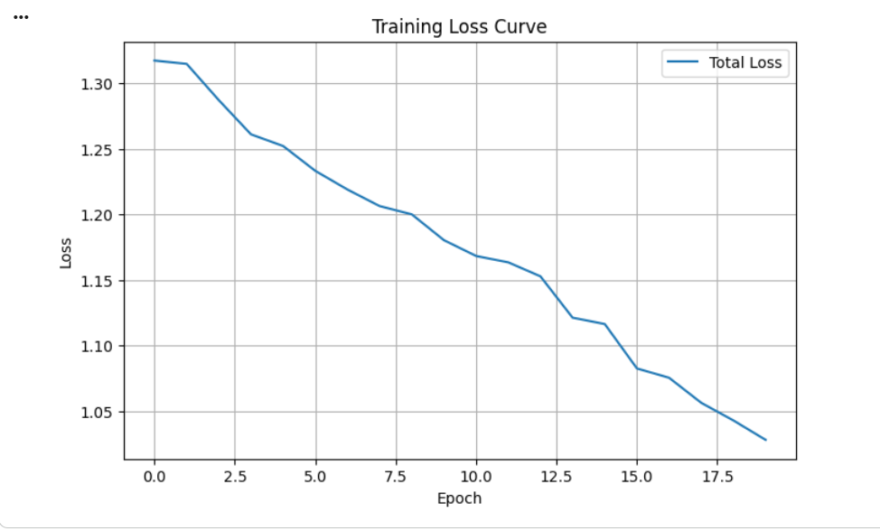
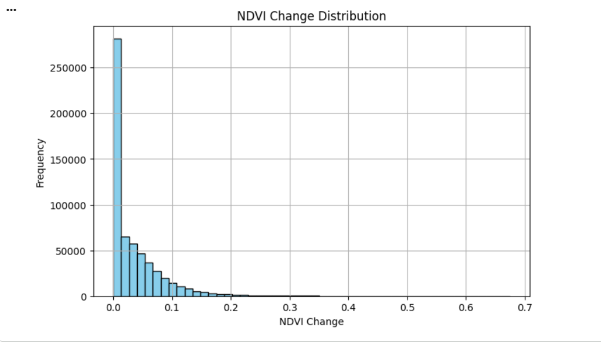
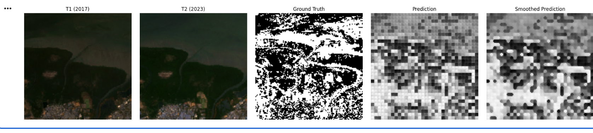

 
<h1 align="center">CHANGEFORMER: SENTINEL-2 CHANGE DETECTION</h1>
 

A transformer-based deep learning framework for multi-temporal Sentinel-2 imagery to detect vegetation, urban, and environmental changes. 
Leverages patch embeddings, NDVI/NDBI indices, and a patch-based Transformer architecture to produce pixel-wise change maps with high accuracy and efficiency.

 

  
<!-- Badges -->

 
<h2 align="center">Table of Contents</h2>
 

  
- [Introduction](#introduction) 
- [Project Overview](#project-overview) 
- [Data Acquisition & Preprocessing](#data-acquisition--preprocessing) 
- [Model Architecture](#model-architecture) 
- [Training & Evaluation](#training--evaluation) 
- [Results & Visualizations](#results--visualizations) 
- [Performance Metrics](#performance-metrics) 
- [Applications & Impact](#applications--impact) 
- [Conclusion](#conclusion) 
- [Contact & License](#contact--license)

 
<h2 align="center" id="introduction">Introduction</h2>
 

This repository implements <strong>ChangeFormer</strong>, a deep learning model for automated change detection in multi-temporal Sentinel-2 images. 
Key highlights:

  
- Patch-based Transformer architecture 
- Spectral indices (NDVI & NDBI) for vegetation and urban change detection 
- Cloud filtering and augmentation for robust model training 
- Generates accurate pixel-wise change maps suitable for environmental monitoring and urban planning

 
<h2 align="center" id="project-overview">Project Overview</h2>
 

  
- Detects temporal changes between Sentinel-2 images using Transformer-based embeddings 
- Handles multispectral data including RGB, NIR, and SWIR bands 
- Patch extraction and augmentation ensure a diverse and robust training set 
- Outputs include visual change maps and quantitative evaluation metrics

 
<h2 align="center" id="data-acquisition--preprocessing">Data Acquisition & Preprocessing</h2>
 

  
- Access Sentinel-2 imagery via <strong>Google Earth Engine</strong> with &lt; 20% cloud coverage 
- Selected bands: B2, B3, B4, B8, B11 
- Computed indices: <strong>NDVI</strong> (vegetation) and <strong>NDBI</strong> (built-up areas) 
- Converted EE images to NumPy arrays and segmented into overlapping patches 
- Data augmentation: flipping, rotation, brightness/contrast adjustment, and translation to increase variability

 
<h2 align="center" id="model-architecture">Model Architecture</h2>
 

  
- <strong>Patch Embedding:</strong> Converts image patches into feature vectors 
- <strong>Transformer Blocks:</strong> Capture temporal differences between t1 and t2 
- <strong>Decoder:</strong> Reconstructs pixel-wise change maps 
- <strong>Loss:</strong> BCE + Dice loss for stable and accurate training

 
<h2 align="center" id="training--evaluation">Training & Evaluation</h2>
 

  
- Optimizer: <strong>AdamW</strong> with learning rate 1e-4 
- Batch-wise loading of augmented patches 
- Training on NVIDIA GPUs or compatible Colab runtime 
- Evaluation metrics: IoU, Precision, Recall, F1-score 
- Training shows stable convergence with smooth loss curves

 
<h2 align="center" id="results--visualizations">Results & Visualizations</h2>
 

<h3 align="center">Training Loss Curve</h3>
 

Smooth convergence of the training loss over 20 epochs indicates robust model optimization.

<h3 align="center">NDVI Change Distribution</h3>
 

Distribution shows areas with significant vegetation changes between two time points.

<h3 align="center">Before & After Comparison</h3>
 

Pixel-wise visualization clearly demonstrates vegetation growth and urban expansion.

 
<h2 align="center" id="performance-metrics">Performance Metrics</h2>
 

The following table summarizes the model performance for ChangeFormer on Sentinel-2 change detection:

 

<table align="center" border="1" cellpadding="10" cellspacing="0" style="border-collapse: collapse;">
  <thead>
    <tr style="background-color:#4CAF50; color:white;">
      <th>Metric</th>
      <th>Value</th>
    </tr>
  </thead>
  <tbody>
    <tr>
      <td>IoU</td>
      <td>0.5338</td>
    </tr>
    <tr>
      <td>Precision</td>
      <td>0.6448</td>
    </tr>
    <tr>
      <td>Recall</td>
      <td>0.7563</td>
    </tr>
    <tr>
      <td>F1-score</td>
      <td>0.6961</td>
    </tr>
  </tbody>
</table>

Metrics indicate strong detection capability with minimal false positives.

 
<h2 align="center" id="applications--impact">Applications & Impact</h2>
 

  
- Environmental monitoring: deforestation, vegetation growth, degradation 
- Urban planning: infrastructure expansion and land-use change 
- Disaster assessment: floods, wildfires, or environmental hazards 
- Scientific research: long-term temporal analysis of ecological and urban changes

 
<h2 align="center" id="conclusion">Conclusion</h2>
 

ChangeFormer demonstrates that Transformer-based architectures are effective for multispectral change detection. 
Patch-based embeddings combined with NDVI/NDBI indices provide automated, accurate detection supporting various real-world applications.

 
<h2 align="center">Contact & Contribution</h2>
 

Have feedback, want to collaborate, or want to extend this project? 
<strong>Let’s connect and enhance multispectral change detection and environmental monitoring together.</strong>

Email: <a href="mailto:hamaylzahid@gmail.com">hamaylzahid@gmail.com</a> &nbsp; | &nbsp;
LinkedIn: <a href="https://www.linkedin.com/in/hamaylzahid">Profile</a> &nbsp; | &nbsp;
GitHub Repo: <a href="https://github.com/hamaylzahid/ChangeFormer-Sentinel2-Change-Detection">Repository</a>

Found this project useful? Give it a star. 
Want to improve it? Submit a pull request and join the development. 

 
<h2 align="center">License</h2>
 

This project is licensed under the <strong>MIT License</strong> and is open for use, modification, and distribution.

<strong>Developed with deep learning, Sentinel-2 imagery, and environmental monitoring principles in mind.</strong>

&nbsp;•&nbsp;

&nbsp;•&nbsp;

 

<i>Designed for multispectral change detection, environmental monitoring, and automated change mapping.</i>

